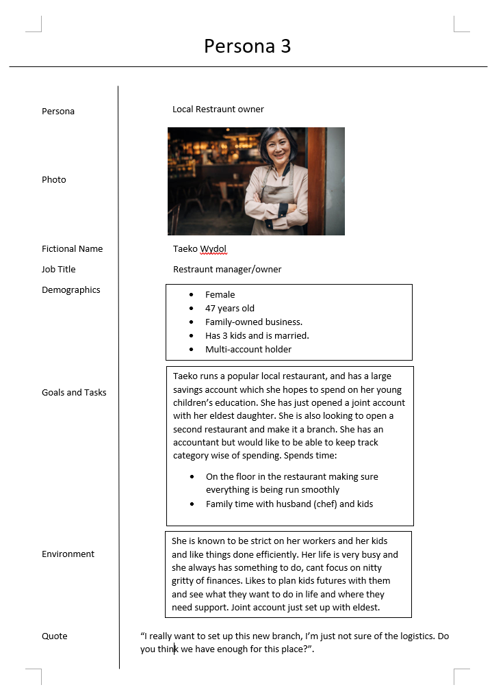

**Coursework 1**

*Textual Analysis*
(By Mikhail Kolyakin)

*Set of User Stories*
(By Mikhail Kolyakin)

1. As a user, I want to be able to connect my bank account to the app so that I can view my account information and transaction history.
2. As a user, I want to be able to view my spending totals by category (e.g. car, clothing) so that I can better understand my overall spending patterns.
3. As a user, I want to be able to set average or usual costs for variable expenses (e.g. phone bill) so that I can better plan my monthly budget.
4. As a user, I want to be able to change the default category for a transaction from a pre-recognized shop so that I can accurately categorize my spending.
5. As a multi-account user, I want to be able to view a summary of my spending and budget across all accounts so that I can get a holistic view of my finances.
6. As a user, I want to be able to set reminders for upcoming bills and expenses so that I don't accidentally overspend and miss payments.
7. As a user, I want to be able to view how much money I have left each month for fun and casual spending so that I can avoid overspending and ensure I have enough for necessary expenses.

So, set of user stories more look like requirements and describe what exactly users want out of this app. Those stories could help to identify what gaps could be missed and what needs more attention. The main questions here is this app going to be delevoped for smartphones or PCs or both at the same time. Overall, user stories are a useful tool for ensuring that the app is designed with the user in mind and that it meets their needs and expectations.

*Use Case Diagram*
(By Mikhail Kolyakin)

This Use Case diagram helps visualize specification and organize various use cases. Different cases can show what interactions user will do to interact with system. It also helps to identify some features that will be neeeded to be implemented. With this diagram it possible to imagine different scenarios that impossible without it.

*Possible Lo-Fi Prototype*
(By Mikhail Kolyakin)

If this app is gonna be implemented, it will require different permissions from the bank and users at the same time. Also, it needs to have secure encryptment system to provide safety for users. The app will enable users to see totals for different categories and types of expenses, such as fixed or unpredictable expenses. Besides, app will allow users to track their monthly bills and set an average or usual cost for variable bills.

*Personas Diagram*
(By Harry Brown)

From these personas we can see the value of focusing on the usability of the app. This is apparent in persona 1 where we have a potential customer who is looking to take control of their finances better and so we would need to make sure the software is easy to learn and get a grip with. Persona 2 gives us an understanding of how important it is to make sure users have a simple, yet detailed way of going over their spending, and making it clear what 'Casual Spending' money they have left at the end of the month. Someone who has a lot of cash flow through their bank account like someone making a paycheck to paycheck living is a prime example of why catagorising peoples spending is important, as to not leave the end user to much work to do when trying to understand where their money is going/coming from. Persona 3 shows us the benfit of including and catering for multi-account holders, like the familes, who are often the root of many future bank accounts and future users. 

The reason we chose to use this diagram is because it's perfect for getting a better understanding of the end user, and ironing out edge cases a developer might forget about when developing the program with themselves in mind.

State diagram(By Omar Taher): 

Welcome state: This is the initial state of the app. The user can choose to sign in or create a new account.

Sign in transition: When the user selects the sign in option, the app transitions to the "Log in" state.

Create account transition: When the user selects the create account option, the app transitions to the "Create account" state.

Log in state: The user enters their login details and the app checks the database for the matching user account. If the login details are correct, the app transitions to the "Dashboard" state. If the login details are incorrect, the app displays an error message and remains in the "Log in" state.

Create account state: The user enters their personal details and sets up their account preferences. Once the account is created, the app transitions to the "Dashboard" state. 
Dashboard state: This is the main state of the app where the user can view their financial information. From here, the user can navigate to different sections of the app.

Accounts transition: When the user selects the accounts option, the app transitions to the "Accounts" state.

Transactions transition: When the user selects the transactions option, the app transitions to the "Transactions" state.

Categories transition: When the user selects the categories option, the app transitions to the "Categories" state.

Accounts state: The user can view their account information, such as the account balance, scheduled payments, and available funds. From here, the user can navigate to different sections of the app or return to the "Dashboard" state.

Transactions state: The user can view their transaction history, categorize transactions, and create new transactions. From here, the user can navigate to different sections of the app or return to the "Dashboard" state.

Categories state: The user can view their categories and set up new categories. From here, the user can navigate to different sections of the app or return to the "Dashboard" state.

Sequential diagram(By Abdulaziz Sarkhoh)

Possible Questions:
- How app will provide security of users' data?
- How app gonna notify users about upcoming payments?
- Will app require to enter into it for each bank account they want to link?
- Would we have to implement support for multiple languages for multi-lingual users?
